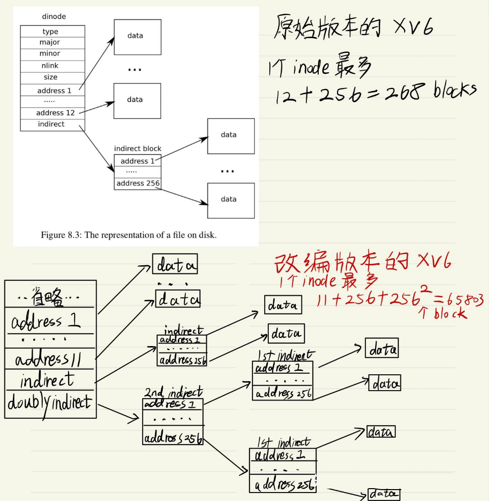

### 资料

###### 中译课程：[【操作系统工程】精译【MIT 公开课 MIT6.S081】_哔哩哔哩_bilibili](https://www.bilibili.com/video/BV1rS4y1n7y1/?spm_id_from=333.337.search-card.all.click&vd_source=f4de6e2e33c1154eb305b3593f38fe41)

###### XV6中文文档：[介紹 | xv6 中文文档](https://th0ar.gitbooks.io/xv6-chinese/content/index.html)

###### 课程网站：[6.S081 / Fall 2021](https://pdos.csail.mit.edu/6.828/2021/schedule.html)

###### 课程作业：[6.S081 / Fall 2021](https://pdos.csail.mit.edu/6.828/2021/schedule.html)

###### 指南：[28天速通MIT 6.S081操作系统公开课 - 总结帖 - 知乎](https://zhuanlan.zhihu.com/p/632281381?utm_campaign=&utm_medium=social&utm_psn=1883544763057299689&utm_source=qq)

###### xv6 操作系统的深入讲解:[正明大佐的个人空间-正明大佐个人主页-哔哩哔哩视频](https://space.bilibili.com/1040264970)

###### 课程教材翻译：[xv6-riscv-book-zh-cn - ArxivTL](https://blog.betteryuan.top/archives/xv6-riscv-book-zh-cn)

###### 学习笔记：[Mit6.S081学习笔记 - 飞书云文档](https://tarplkpqsm.feishu.cn/docs/doccnoBgv1TQlj4ZtVnP0hNRETd)

###### lab1:[操作系统实验Lab 1:Xv6 and Unix utilities(MIT 6.S081 FALL 2020)_git checkout util-CSDN博客](https://blog.csdn.net/weixin_48283247/article/details/120602005)

###### lab2:[操作系统实验Lab 2:system calls(MIT 6.S081 FALL 2020)_mit操作系统实验2020-CSDN博客](https://blog.csdn.net/weixin_48283247/article/details/121217307)

###### 源码分析：[xv6 系统启动代码分析(MIT 6.S081 FALL 2020)_v,。08080 0-CSDN博客](https://blog.csdn.net/weixin_48283247/article/details/121160992)

## 环境配置：

首先准备wsl,ubuntu

### vim编辑器

如果无法从系统剪切板复制粘贴，检查：vim --version | grep clipboard

输出应包含 `+clipboard` 和 `+xterm_clipboard`。

如若没有，可选择配置永久生效方式：

在 `~/.vimrc` 中添加以下配置，简化操作：

" 设置默认使用系统剪贴板“
set clipboard=unnamedplus

### make qemu

如果出现：
user/sh.c: In function ‘runcmd’: user/sh.c:58:1: error: infinite recursion detected [-Werror=infinite-recursion]

可以选择**禁用递归警告（快速绕过）**

在 `Makefile` 中找到以下行：

~~~
CFLAGS = -Wall -Werror -O -fno-omit-frame-pointer -ggdb
~~~

将 `-Werror` 替换为 `-Wno-error=infinite-recursion`，修改后应如下：

~~~
CFLAGS = -Wall -Wno-error=infinite-recursion -O -fno-omit-frame-pointer -ggdb
~~~

### 退出qemu

ctrl + a

然后按 x

### python和换行符

root@LAPTOP-FNG9568N:~/GIT/xv6-labs-2020# ./grade-lab-util sleep /usr/bin/env: ‘python’: No such file or directory

需要下载并更换python

~~~
sudo apt update
sudo apt install python3

# 将 python 指向 python3
sudo ln -s /usr/bin/python3 /usr/bin/python
~~~

将 `grade-lab-util` 首行的 `python` 改为 `python3`

~~~
sed -i '1s/python$/python3/' grade-lab-util

python --version
# 应输出 Python 3.x.x
~~~

安装依赖包（可选）

~~~
sudo pip3 install pexpect
~~~

修复换行符（可选）

~~~
sudo apt install dos2unix
dos2unix grade-lab-util
~~~

重新运行测试

~~~
./grade-lab-util sleep
~~~


# labs

## lab1: Utilities

### sleep

第一个utility功能是调用系统函数sleep来实现用户函数**sleep**. 主要是让我们熟悉一下怎么在这个xv6环境里写代码. 需要注意的是, 在这一系列的实验里, 我们是无法调用传统意义上的C标准库的. 所有能够调用的系统函数都在**user/user.h**里. 一共大概就20来个, 先扫一眼有个印象. 具体需要的时候可以再跳转到具体实现文件里去读.

这个sleep函数的要求很简单: 如果用户忘记传入参数了, 报错并退出. 不然就parse输入的参数为**int**, 直接调用系统函数**sleep**.

**==【注意】==**sleep.c等文件，需要放在user文件下，并且把sleep文件目标加入Makefile中，然后make qemu

### pingpong

第二个utility功能**pingpong**是利用系统调用函数**fork**和**pip**e在父进程和子进程前交换一个字节, 是一个比较简单的题. 主要的点有两个:

~~~c++
// 第一点
int fd[2];
pipe(fd);
// 可以向fd[1]写, 并从fd[0]中读出来

// 第二点
// fork创建完子进程后, 在父进程中打开的file descriptor会被复制保持打开状态到子进程中
// 由此我们可以利用先开好pipe再fork, 完成父子进程的communication
~~~

### primes

第三个utility功能**primes**是用pipeline来实现**[Sieve质数算法](https://zhida.zhihu.com/search?content_id=226818217&content_type=Article&match_order=1&q=Sieve质数算法&zhida_source=entity)**, 想了好一会儿才把思路捋清, 这题还是有点意思的. 从算法上来说, 这个算法的思路是这样的:

1. 每个进程被assign了一个质数, 它会把这个质数打印在屏幕上
2. 它从左手边的进程不断接收数字, 如果这个数字是自己质数的倍数, 就把它过滤掉. 不然就**fork**出一个新的进程, 把这个数字assign并传给那个进程
3. 每个进程都需等待它的子进程结束后才可以退出, 形成了一条进程生命周期依赖链

思路归思路, 在具体代码实现的时候会有具体几个问题需要解决:

~~~
1. 一个进程怎么知道自己被分配的质数?
# 它从左手边进程读来的第一个数字就是自己的质数

2. 怎么从左边进程读数字?
# 写一个递归函数, 参数传进来一个pipe的读端fd

3. 怎么等待子进程都结束保证进程生命周期链的正确性?
# 每个进程最多fork出一个子进程, 直接wait(int* pid)即可. 如果一个进程从没有fork过子进程, 那么它不需要等待

* 代码过程中需要注意及时关闭一切用不到的file descriptors, 不然会超过xv6的系统fd上限
~~~

### find

第四个utility功能是**find**. 给定一个初始路径和目标文件名, 要不断递归的扫描找到所有子目录前匹配的文件全路径. 实验手册里让我们模仿l**s**用户函数的实现来实现这个功能. 主要是要学一下文件系统的操作.

从**ls**用户函数的实现里, 主要可以领悟到4个点:

~~~
# 1. 如何知道一个路径是文件还是目录?
int fd = open(curr_path, 0);
fstat(fd, &st);
st.type 是 T_DIR 或者 T_FILE

# 2. 如何递归地扫描一个目录?
如果已知一个fd对应的是一个目录, 我们可以不断读取DIRSIZ大小bytes来迭代每个子文件/子文件目录
struct dirent de;
while(read(fd, &de, sizeof(de)) == sizeof(de)) {
  // de.name 得到文件名
  ...
}

# 3. 我们需要一路上自己不断构造完整路径, 需要保存一个buffer, 并在合适的时候加上'/[subdirectory]'进入递归

# 4. 记得及时关闭不再使用的file descriptor, 
  一开始我忘记关了后很快xv6就报错fail to open files, 仔细看了代码半天才发现是这个问题
~~~

### xargs

第五个utility是**xargs**. 将标准输入里每一个以'**\n**'分割的行作为单独1个额外的参数, 传递并执行下一个命令. 这题主要感觉是考察**fork + exec**的使用. 但真正实现的时候, 麻烦点在于滑动窗口buffer的管理. 有以下这几个点需要思考的:

~~~
# 1. 什么时候知道不会有更多的行输入了?
当从file descriptor 0读的时候, 读到返回值为0

# 2. 怎么能抓出每一个以'\n'分割的行?
我们不能方便地从file descriptor里读到空行符为止, xv6没有这样的库函数支持.
我们需要自己管理一个滑动窗口buffer, 如下:

假设我们有1个长度为10的buffer, 以 . 代表为空
buf = [. . . . . . . . . .]
我们read(buf, 10)读进来6个bytes
buf = [a b \n c d \n . . . .]

这时我们需要做的是, 
1. 找到第一个'\n'的下标, 用xv6提供的strchr函数, 得到下标为2
2. 把下标0～1的byte转移到另一个buffer去作为额外参数
3. 执行fork+exec+wait组合拳去执行真正执行的程序, 使用我们parse出来的额外的参数
4. 修建我们的buffer, 把0～2的byte移除, 把3～9的byte移到队头
此时buffer变成:
buf = [c d \n . . . . . . .]

# 3. 上述操作要一直循环直到
file descriptor 0 已经关闭了 && buffer里的所有读入的bytes都处理完了
~~~

## lab2: System Calls

### trace

在**user/user.h**里提供一个用户的接口

~~~
int trace(int);  // 新系统调用trace的函数原型签名
~~~

在**user/usys.pl**里为这个函数签名加入一个entry.

~~~
entry("trace");
~~~

**kernel/proc.h** 加一个field

~~~
struct proc {
.....
uint64 tracemask;            // the sys calls this proc is tracing  << 新的field加在这里
};
~~~

**kernel/proc.c** 修改2个函数

~~~
// Look in the process table for an UNUSED proc.
// If found, initialize state required to run in the kernel,
// and return with p->lock held.
// If there are no free procs, or a memory allocation fails, return 0.
static struct proc*
allocproc(void)
{
  ...省略...
  // Zero initializes the tracemask for a new process << 新的进程默认不追踪sys calls
  p->tracemask = 0;
  return p;
}

// Create a new process, copying the parent.
// Sets up child kernel stack to return as if from fork() system call.
int
fork(void)
{
  int i, pid;
  struct proc *np;
  struct proc *p = myproc();

  // Allocate process.
  if((np = allocproc()) == 0){
    return -1;
  }

  // inherit parent's trace mask << fork出的新进程继承父进程的bit mask
  np->tracemask = p->tracemask;
  ...省略...
}
~~~

实现内核态下的**sys_trace**函数, 用**argint**函数从寄存器拿参数, 用**myproc**获得当前进程的一个指针

~~~
# kernel/sysproc.c

// click the sys call number in p->tracemask
// so as to tracing its calling afterwards
uint64 
sys_trace(void) {
  int trace_sys_mask;
  if (argint(0, &trace_sys_mask) < 0)
    return -1;
  myproc()->tracemask |= trace_sys_mask;
  return 0;
}
~~~

为这个sys_trace提供一个代号和函数指针的mapping. 并且顺手加上一个从代号到名字的mapping, 便于print

~~~
# kernel/sys_call.h
...
#define SYS_mkdir  20
#define SYS_close  21
#define SYS_trace  22

# kernel/sys_call.c

extern uint64 sys_trace(void);

static uint64 (*syscalls[])(void) = {
 ...省略...
[SYS_mkdir]   sys_mkdir,
[SYS_close]   sys_close,
[SYS_trace]   sys_trace,
};

static char *sysnames[] = {
    "",
    ...省略...
    "mkdir",
    "close",
    "trace",
};
~~~

 最后我们修改通用入口syscall函数, 让它print出需要trace的系统调用

~~~
# kernel/syscall.c
...省略...
void
syscall(void)
{
  int num;
  struct proc *p = myproc();

  num = p->trapframe->a7; // 系统调用代号存在a7寄存器内
  if(num > 0 && num < NELEM(syscalls) && syscalls[num]) {
    p->trapframe->a0 = syscalls[num](); // 返回值存在a0寄存器内
    if (p->tracemask & (1 << num)) { // << 判断是否需要trace这个系统调用
      // this process traces this sys call num
      printf("%d: syscall %s -> %d\n", p->pid, sysnames[num], p->trapframe->a0);
    }
  } else {
    printf("%d %s: unknown sys call %d\n",
            p->pid, p->name, num);
    p->trapframe->a0 = -1;
  }
}
~~~

- 用户呼叫我们提供的系统调用接口 **int trace(int)**
- 这个接口的实现由**perl**脚本生成的汇编语言实现, 将**SYS_trace**的代号放入**a7**寄存器, 由**ecall**硬件支持由用户态转入内核态
- 控制转到系统调用的通用入口 **void syscall(void)** 手上. 它由**a7**寄存器读出需要被调用的系统调用是第几个, 从*uint64 (\*syscalls[])(void)*这个函数指针数组跳转到那个具体的系统调用函数实现上. 将返回值放在**a0**寄存器里
- 我们从第二步的**ecall**里退出来了, 汇编指令**ret**使得用户侧系统调用接口返回

把文件目标加入Makefile后进行lab批分, 顺利通过.

### sysinfo

新增的系统调用的步骤和上面**trace**基本一致, 一些基础的CRUD代码参照上面即可（比如加一个用户侧的接口, 加一个**sysinfo**系统调用的代号和函数指针等）

根据实验指引, 我们来看**kernel/kalloc.c**内核文件. 我们可以观察到的是, 每个物理内存页的单位是**PGSIZE=4096**字节, 以一个单链表的形式管理空闲内存页. 整个xv6的内存地址空间是由**void kinit()**这个函数来定义的. 既然我们知道**kmem->freelist**指向第一个空余内存页, 然后去计算整个系统的空余内存只需要遍历一次这个单链表即可

~~~
# kernel/kalloc.c
// Return the number of bytes of free memory
// should be multiple of PGSIZE
uint64
kfreemem(void) {
  struct run *r;
  uint64 free = 0;
  acquire(&kmem.lock); // 上锁, 防止数据竞态
  r = kmem.freelist;
  while (r) {
    free += PGSIZE; // 每一页固定4096字节
    r = r->next; // 遍历单链表
  }
  release(&kmem.lock);
  return free;
}
~~~

根据实验指引, 我们来看**kernel/proc.c**内核文件. 在这个文件的一开头, 我们看到xv6静态分配了最多64个进程的信息存储空间在**struct proc proc[NPROC]**. 同时在**void procinit(void)里**每一个存储空间都被初始化了, 不会有空悬指针访问的危险. 所以我们遍历这个存储空间列表即可知道分配出去了多少进程.

~~~
# kernel/proc.c
// Count how many processes are not in the state of UNUSED
uint64
count_free_proc(void) {
  struct proc *p;
  uint64 count = 0;
  for(p = proc; p < &proc[NPROC]; p++) {
    // 此处不一定需要加锁, 因为该函数是只读不写
    // 但proc.c里其他类似的遍历时都加了锁, 那我们也加上
    acquire(&p->lock);
    if(p->state != UNUSED) {
      count += 1;
    }
    release(&p->lock);
  }
  return count;
}
~~~

**xv6**的用户态和内核态的数据并不能直接交互. 粗略地看了一眼拷贝进和出的具体实现函数, 似乎是和虚拟内存地址的寻址有关系, 这个之后我们应该会在lab3里继续探究. 我们这里需要使用**copyou**t函数来将内核态的数据拷贝到用户态地址上

~~~
# kernel/sysproc.c
// collect system info
uint64
sys_sysinfo(void) {
  struct proc *my_proc = myproc();
  uint64 p;
  if(argaddr(0, &p) < 0) // 获取用户提供的buffer地址
    return -1;
  // construct in kernel first 在内核态先构造出这个sysinfo struct
  struct sysinfo s;
  s.freemem = kfreemem();
  s.nproc = count_free_proc();
  // copy to user space // 把这个struct复制到用户态地址里去
  if(copyout(my_proc->pagetable, p, (char *)&s, sizeof(s)) < 0)
    return -1;
  return 0;
}
~~~

把文件目标（sysinfotest)加入Makefile后进行lab批分, 顺利通过.

## lab3: Page Tables

### print a page table

为什么判定一个**PTE**是一个指向下一层page table的**PTE**的条件是

~~~
// 此条件等于该pte不是终末层, 而是指向下一层
(pte & (PTE_R|PTE_W|PTE_X)) == 0
~~~

为了弄明白这一点, 需要看特定两个地方的实现细节:

~~~
// 中间层只有PTE_V flag
pte_t *
walk(pagetable_t pagetable, uint64 va, int alloc)
{
  ...省略...
  for(int level = 2; level > 0; level--) {
    ...
    if(*pte & PTE_V) {
      ...
    } else {
      ...
      *pte = PA2PTE(pagetable) | PTE_V; // << 间接层pte只有PTE_V flag被设立起来
    }
  }
  return &pagetable[PX(0, va)];
}

// 终末层所有flag都有
uint64
uvmalloc(pagetable_t pagetable, uint64 oldsz, uint64 newsz)
{
  ...省略...
  oldsz = PGROUNDUP(oldsz);
  for(a = oldsz; a < newsz; a += PGSIZE){
    ...
    // W, X, R, U flag全部都设立起来
    if(mappages(pagetable, a, PGSIZE, (uint64)mem, PTE_W|PTE_X|PTE_R|PTE_U) != 0){
       ...
    }
  }
  return newsz;
}
~~~

### a kernel page table per process

要求是, 原本xv6只有1个内核页, 现在希望为每个新进程单独分配一个属于它的内核页. 一方面是使得每个进程拥有更好的**isolation**和**modularity**, 另一方面根据实验手册的说法, 在用户进程切入内核态后, 内核态就可以直接使用那个进程专属的内核页, 而不是用**walk**函数去模拟硬件寻址来翻译出用户虚拟地址所对应的真实物理地址.

为**struct proc**加入一个新的field

~~~
# kernel/proc.h
// Per-process state
struct proc {
  ...省略...
  uint64 tracemask;            // the sys calls this proc is tracing
  pagetable_t kpagetable;      // the kernel table per process 专属内核页
};
~~~

 模仿**kvminit**函数, 在**allocproc**函数里为新进程分配它的专属内核页

```c
# kernel/vm.c
// add a mapping to the per-process kernel page table.
void
ukvmmap(pagetable_t kpagetable, uint64 va, uint64 pa, uint64 sz, int perm)
{
  if(mappages(kpagetable, va, sz, pa, perm) != 0)
    panic("ukvmmap");
}

/*
 * create a direct-map page table for the per-process kernel page table.
 * return nullptr when kalloc fails
 */
pagetable_t
ukvminit()
{
  pagetable_t kpagetable = (pagetable_t) kalloc();
  if (kpagetable == 0) {
    return kpagetable;
  }
  memset(kpagetable, 0, PGSIZE);
  // 把固定的常数映射照旧搬运过来
  // uart registers
  ukvmmap(kpagetable, UART0, UART0, PGSIZE, PTE_R | PTE_W);
  // virtio mmio disk interface
  ukvmmap(kpagetable, VIRTIO0, VIRTIO0, PGSIZE, PTE_R | PTE_W);
  // CLINT
  ukvmmap(kpagetable, CLINT, CLINT, 0x10000, PTE_R | PTE_W);
  // PLIC
  ukvmmap(kpagetable, PLIC, PLIC, 0x400000, PTE_R | PTE_W);
  // map kernel text executable and read-only.
  ukvmmap(kpagetable, KERNBASE, KERNBASE, (uint64)etext-KERNBASE, PTE_R | PTE_X);
  // map kernel data and the physical RAM we'll make use of.
  ukvmmap(kpagetable, (uint64)etext, (uint64)etext, PHYSTOP-(uint64)etext, PTE_R | PTE_W);
  // map the trampoline for trap entry/exit to
  // the highest virtual address in the kernel.
  ukvmmap(kpagetable, TRAMPOLINE, (uint64)trampoline, PGSIZE, PTE_R | PTE_X);
  return kpagetable;
}

======================================================================
# kernel/proc.c
static struct proc*
allocproc(void)
{
  ...

found:
  p->pid = allocpid();
  ...
  // An empty user page table.
  p->pagetable = proc_pagetable(p);
  if(p->pagetable == 0){
    freeproc(p);
    release(&p->lock);
    return 0;
  }

  // Allocate the per-process kernel page table
  // 为这个进程分配并初始化一个新的专属内核页
  p->kpagetable = ukvminit();
  if(p->kpagetable == 0) {
    freeproc(p);
    release(&p->lock);
    return 0;
  }
  ...
}
```

在这个新的专属内核页里, 把这个新进程的**kernel stack**映射上. 注意在**procinit**函数里, 所有进程的kernel stack的物理页都已经被分配了. 我们并不需要重新去分配物理页, 只需要建立映射mapping即可.

```c
# kernel/proc.h
static struct proc*
allocproc(void)
{
  ...

found:
  p->pid = allocpid();
  ...
  // An empty user page table.
  p->pagetable = proc_pagetable(p);
  if(p->pagetable == 0){
    freeproc(p);
    release(&p->lock);
    return 0;
  }

  // Allocate the per-process kernel page table
  // 为这个进程分配并初始化一个新的专属内核页
  p->kpagetable = ukvminit();
  if(p->kpagetable == 0) {
    freeproc(p);
    release(&p->lock);
    return 0;
  }

  // remap the kernel stack page per process
  // physical address is already allocated in procinit()
  // 每个kernel stack的虚拟地址va是已经提前决定好的 直接算出它对应的pa
  // 然后把这个映射加入到新的专属内核页里
  uint64 va = KSTACK((int) (p - proc));
  pte_t pa = kvmpa(va);
  memset((void *)pa, 0, PGSIZE); // 刷新清空kernel stack
  ukvmmap(p->kpagetable, va, (uint64)pa, PGSIZE, PTE_R | PTE_W);
  p->kstack = va;
  ...
}
```

在**scheduler**切换进程的时候, 刷新TLB和使用的虚拟-物理页表影射base. 注意在进程切换跑完返回后, 要重新切换回全局的kernel page. 这个点让我debug了好几个小时.

```c
# kernel/proc.c
void
scheduler(void)
{
  struct proc *p;
  struct cpu *c = mycpu();
  
  c->proc = 0;
  for(;;){
    // Avoid deadlock by ensuring that devices can interrupt.
    intr_on();
    
    int found = 0;
    for(p = proc; p < &proc[NPROC]; p++) {
      acquire(&p->lock);
      if(p->state == RUNNABLE) {
        // Switch to chosen process.  It is the process's job
        // to release its lock and then reacquire it
        // before jumping back to us.
        p->state = RUNNING;
        c->proc = p;
        // 切换到要马上运行的新进程的内核页表
        w_satp(MAKE_SATP(p->kpagetable));
        sfence_vma();
        swtch(&c->context, &p->context);

        // Process is done running for now.
        // It should have changed its p->state before coming back.
        // 切换回全局内核页表
        kvminithart();
        c->proc = 0;

        found = 1;
      }
      release(&p->lock);
    }
    ...
}
```

在销毁一个进程时, 回收它的内核页表. 这里需要注意的是, 我们并不需要去回收内核页表所映射到的物理地址. 因为那些物理地址, 例如device mapping, 是全局共享的. 进程专属内核表只是全局内核表的一个复制. 但是间接映射所消耗分配的物理内存是需要回收的. 举个例子, 在kernel pagetable可能有这样一个三级映射:

0x 810 (第一级) -> 0x 910 (第二级) -> 0x 1100(第三级) -> 0x 10000000L **UART0**

我们是需要把**0x 810**, **0x 910**, **0x 1100** 回收的, 但是**UARTO**不需要回收因为是共享的.

```c
# kernel/vm.c

// Unmap the leaf node mapping
// of the per-process kernel page table
// so that we could call freewalk on that
void
ukvmunmap(pagetable_t pagetable, uint64 va, uint64 npages)
{
  uint64 a;
  pte_t *pte;

  if((va % PGSIZE) != 0)
    panic("ukvmunmap: not aligned");

  for(a = va; a < va + npages*PGSIZE; a += PGSIZE){
    if((pte = walk(pagetable, a, 0)) == 0)
      goto clean;
    if((*pte & PTE_V) == 0)
      goto clean;
    if(PTE_FLAGS(*pte) == PTE_V)
      panic("ukvmunmap: not a leaf");

    clean:
      *pte = 0;
  }
}

// Recursively free page-table pages similar to freewalk
// not need to already free leaf node
// 和freewalk一模一样, 除了不再出panic错当一个page的leaf还没被清除掉
// 因为当我们free pagetable和kpagetable的时候
// 只有1份物理地址, 且原本free pagetable的函数会负责清空它们
// 所以这个函数只需要把在kpagetable里所有间接mapping清除即可
void
ufreewalk(pagetable_t pagetable)
{
  // there are 2^9 = 512 PTEs in a page table.
  for(int i = 0; i < 512; i++){
    pte_t pte = pagetable[i];
    if((pte & PTE_V) && (pte & (PTE_R|PTE_W|PTE_X)) == 0){
      // this PTE points to a lower-level page table.
      uint64 child = PTE2PA(pte);
      ufreewalk((pagetable_t)child);
      pagetable[i] = 0;
    }
    pagetable[i] = 0;
  }
  kfree((void*)pagetable);
}

// helper function to first free all leaf mapping
// of a per-process kernel table but do not free the physical address
// and then remove all 3-levels indirection and the physical address
// for this kernel page itself
void freeprockvm(struct proc* p) {
  pagetable_t kpagetable = p->kpagetable;
  // reverse order of allocation
  // 按分配顺序的逆序来销毁映射, 但不回收物理地址
  ukvmunmap(kpagetable, p->kstack, PGSIZE/PGSIZE);
  ukvmunmap(kpagetable, TRAMPOLINE, PGSIZE/PGSIZE);
  ukvmunmap(kpagetable, (uint64)etext, (PHYSTOP-(uint64)etext)/PGSIZE);
  ukvmunmap(kpagetable, KERNBASE, ((uint64)etext-KERNBASE)/PGSIZE);
  ukvmunmap(kpagetable, PLIC, 0x400000/PGSIZE);
  ukvmunmap(kpagetable, CLINT, 0x10000/PGSIZE);
  ukvmunmap(kpagetable, VIRTIO0, PGSIZE/PGSIZE);
  ukvmunmap(kpagetable, UART0, PGSIZE/PGSIZE);
  ufreewalk(kpagetable);
}

======================================================================
# kernel/proc.c
// free a proc structure and the data hanging from it,
// including user pages.
// p->lock must be held.
static void
freeproc(struct proc *p)
{
  if(p->trapframe)
    kfree((void*)p->trapframe);
  p->trapframe = 0;
  if(p->pagetable)
    proc_freepagetable(p->pagetable, p->sz);
  p->pagetable = 0;
  p->sz = 0;
  p->pid = 0;
  p->parent = 0;
  p->name[0] = 0;
  p->chan = 0;
  p->killed = 0;
  p->xstate = 0;
  p->state = UNUSED;
  if (p->kpagetable) {
    freeprockvm(p);
    p->kpagetable = 0;
  }
  if (p->kstack) {
    p->kstack = 0;
  }
}
```

### simplify copyin/copyinstr

这个实验承接上一个实验, 我们需要保证每个进程的**pagetable**和**kpagetable**的前半段映射一直保持一致, 这样我们才能在切入内核态时直接使用硬件支持的虚拟/物理内存地址寻址. 按照实验手册的提醒, 在**fork()**, **sbrk()**, **exec()**这些使得进程的**pagetable**发生增长/缩减的地方, 我们需要将**kpagetable**与之进行同步更新.

首先我们写一个helper函数, 来将一段内存映射从**pagetable**复制到**kpagetable**.


```c
# kernel/vm.c

// Same as mappages without panic on remapping
// 和mappages一模一样, 只不过不再panic remapping, 直接强制复写
int umappages(pagetable_t pagetable, uint64 va, uint64 size, uint64 pa, int perm) {
  uint64 a, last;
  pte_t *pte;

  a = PGROUNDDOWN(va);
  last = PGROUNDDOWN(va + size - 1);
  for(;;){
    if((pte = walk(pagetable, a, 1)) == 0)
      return -1;
    *pte = PA2PTE(pa) | perm | PTE_V;
    if(a == last)
      break;
    a += PGSIZE;
    pa += PGSIZE;
  }
  return 0;
}

// copying from old page to new page from
// begin in old page to new in old page
// and mask off PTE_U bit
// 将从begin到end的虚拟地址的映射, 从oldpage复制到newpage
int
pagecopy(pagetable_t oldpage, pagetable_t newpage, uint64 begin, uint64 end) {
  pte_t *pte;
  uint64 pa, i;
  uint flags;
  begin = PGROUNDUP(begin);

  for (i = begin; i < end; i += PGSIZE) {
    if ((pte = walk(oldpage, i, 0)) == 0)
      panic("pagecopy walk oldpage nullptr");
    if ((*pte & PTE_V) == 0)
      panic("pagecopy oldpage pte not valid");
    pa = PTE2PA(*pte);
    flags = PTE_FLAGS(*pte) & (~PTE_U); // 把U flag抹去
    if (umappages(newpage, i, PGSIZE, pa, flags) != 0) {
      goto err;
    }
  }
  return 0;

err:
  uvmunmap(newpage, 0, i / PGSIZE, 1);
  return -1;
}
```

紧接着, 我们在**fork()**, **exec()**, **sbrk()** 和**userinit()**的相应位置进行**pagetable**和**kpagetale**的同步.

**fork()**

```c
# kernel/proc.c
// Create a new process, copying the parent.
// Sets up child kernel stack to return as if from fork() system call.
int
fork(void)
{
  ...

  // Copy user memory from parent to child.
  if(uvmcopy(p->pagetable, np->pagetable, p->sz) < 0){
    freeproc(np);
    release(&np->lock);
    return -1;
  }
  np->sz = p->sz;

  if (pagecopy(np->pagetable, np->kpagetable, 0, np->sz) != 0) {
    freeproc(np);
    release(&np->lock);
    return -1;
  }
  np->parent = p;

  ...
  return pid;
}
```

**exec()**

```c
# kernel/exec.c
int
exec(char *path, char **argv)
{
  ...
    
  // Commit to the user image.
  oldpagetable = p->pagetable;
  p->pagetable = pagetable;
  p->sz = sz;
  p->trapframe->epc = elf.entry;  // initial program counter = main
  p->trapframe->sp = sp; // initial stack pointer
  proc_freepagetable(oldpagetable, oldsz);

  // 复制新的kernel page并刷新TLB
  if (pagecopy(p->pagetable, p->kpagetable, 0, p->sz) != 0) {
    goto bad;
  }
  // 因为load进来了新的program, 刷新一下内存映射
  w_satp(MAKE_SATP(p->kpagetable));
  sfence_vma();

  ...

  return argc; // this ends up in a0, the first argument to main(argc, argv)

}
```

**sbrk()**

```c
# kernel/proc.c
// Grow or shrink user memory by n bytes.
// Return 0 on success, -1 on failure.
int
growproc(int n)
{
  uint sz;
  struct proc *p = myproc();

  sz = p->sz;
  if(n > 0){
    // 内核页的虚拟地址不能溢出PLIC
    if (sz + n > PLIC || (sz = uvmalloc(p->pagetable, sz, sz + n)) == 0) {
      return -1;
    }
    if (pagecopy(p->pagetable, p->kpagetable, p->sz, sz) != 0) {
      // 增量同步[old size, new size]
      return -1;
    }
  } else if(n < 0){
    sz = uvmdealloc(p->pagetable, sz, sz + n);
    if (sz != p->sz) {
      // 缩量同步[new size, old size]
      uvmunmap(p->kpagetable, PGROUNDUP(sz), (PGROUNDUP(p->sz) - PGROUNDUP(sz)) / PGSIZE, 0);
    }
  }
  ukvminithard(p->kpagetable);
  p->sz = sz;
  return 0;
}
```

**userinit()**

```c
# kernel/proc.c
// Set up first user process.
void
userinit(void)
{
  ...
  uvminit(p->pagetable, initcode, sizeof(initcode));
  p->sz = PGSIZE;

  pagecopy(p->pagetable, p->kpagetable, 0, p->sz);

  // prepare for the very first "return" from kernel to user.
  p->trapframe->epc = 0;      // user program counter
  p->trapframe->sp = PGSIZE;  // user stack pointer

  ...
}
```

## lab4: Traps

### risc-v assembly

按实验说明, **make fs.img** 编译出**user/call.asm**来进行分析.

```c
1. Which registers contain arguments to functions? 
For example, which register holds 13 in main's call to printf?

根据risc-v的手册, a0-a7都是可以存放函数调用的参数的.

在main函数的汇编代码中:

000000000000001c <main>:

void main(void) {
  1c:	1141                	addi	sp,sp,-16
  1e:	e406                	sd	ra,8(sp)
  20:	e022                	sd	s0,0(sp)
  22:	0800                	addi	s0,sp,16
  printf("%d %d\n", f(8)+1, 13);
  24:	4635                	li	a2,13
  26:	45b1                	li	a1,12
  28:	00000517          	auipc	a0,0x0
  2c:	7b050513          	addi	a0,a0,1968 # 7d8 <malloc+0xe8>
  30:	00000097          	auipc	ra,0x0
  34:	608080e7          	jalr	1544(ra) # 638 <printf>
  exit(0);
  38:	4501                	li	a0,0
  3a:	00000097          	auipc	ra,0x0
  3e:	274080e7          	jalr	628(ra) # 2ae <exit>

我们可以看到, 寄存器a2存放了13这个值
-------------------------------------------------------------------
2. Where is the call to function f in the assembly code for main? 
Where is the call to g? (Hint: the compiler may inline functions.)
   
一整个函数调用链f(g(8))+1都被编译器直接优化成inline了并算出了答案=12, 放置在了a1寄存器里
由这一行汇编源码可以看出:
   26:	45b1                	li	a1,12
-------------------------------------------------------------------
3. At what address is the function printf located?

由这一行汇编源码:
    0000000000000638 <printf>
我们可以得知printf在0x638的位置


但我们是如何跳转到0x638的位置的呢? 来看一下这两行
  30:	00000097          	auipc	ra,0x0
  34:	608080e7          	jalr	1544(ra) # 638 <printf>

auipcj将0右移12位后赋值给ra并加上当前的指令位置, 所有ra值为0x30.
下一行1544(ra) = 1544 + 0x30 = 0x638 跳转到printf了就
-------------------------------------------------------------------
4. What value is in the register ra just after the jalr to printf in main?

jalr这个指令会把下一个要执行的指令的地址压入ra, 及0x34+4 = 0x38
-------------------------------------------------------------------
5. Run the following code.

   	unsigned int i = 0x00646c72;
   	printf("H%x Wo%s", 57616, &i);

   What is the output? Here's an ASCII table that maps bytes to characters.
   The output depends on that fact that the RISC-V is little-endian.
   If the RISC-V were instead big-endian what would you set i to in order to yield the same output? 
   Would you need to change 57616 to a different value?

   输出的答案是 HE110 World
   57616的hex是0x0000E110
   i=0x00646c72, 字节翻译是0dlr. 因为RISC-V是little-endian, 存放在连续内存里的顺序即是rld0.
   如果RISC-V是big-endian, 57616不用变, i需要变成0x726c6400
-------------------------------------------------------------------
6. In the following code, what is going to be printed after 'y='? 
(note: the answer is not a specific value.) Why does this happen?

   	printf("x=%d y=%d", 3);

printf的format字符串在寄存器a0, 3在寄存器a1, 所以当试图print y的时候, 留在寄存器a2的某个随机值就会被print出来
```

### backtrace

需要关注的有: **stack**栈是向上增长的, 即每次新call一个函数, 就会新allocate一个**stack frame**在当前stack frame的头上(更高地址address处). 当一个函数完成后, 它的stack frame就会被销毁, 同时**program counte**r就重新跳转到上一个函数跳进来的位置的下一条指令. 这个跳转的位置是可以从**Return Address**这个位置读出来的.

那么对于我们的**backtrace**函数, 在有了当前**frame pointe**r(fp)后, 我们只需要不断地print出**Return Address**(地址为fp-0x8), 然后把**fp**设置成上一个函数的**fp**(地址为fp-0x10)

那么一直跳转到什么时候停下来呢? 实验手册说了, 栈空间在**xv6**里只占1页, 所以我们不断迭代一直到这一页的页底就可以结束了.

### alarm

这个实验是需要我们能实现一个signal alarm. 每隔一段时间, 执行用户所提供的函数一次. 我们按部就班, 根据实验手册的提示来实现.

**第一部分**

首先很常规的把2个新的system call **sigalarm**和**sigreturn**加入到相对应的头文件里, 使得可以编译. **sigreturn**暂时为空, 直接返回**0**.

首先在每个**struct proc**里加入新的三个需要管理的fields.

```c
# kernel/proc.h
// Per-process state
struct proc {
  struct spinlock lock;
  ...省略...
  uint64 tracemask;            // the sys calls this proc is tracing
  pagetable_t kpagetable;      // the kernel table per process
  int alarm_period;            // the alarm period set
  void (*alarm_handler)();     // the alarm function handler
  int ticks_since_last_alarm;  // how many ticks has elapsed since last alarm
};
```

在用户呼叫**sigalarm**函数时, 把提供的参数记录进**struct proc**里.

```c
// set an alarm to call the handler function
// every period ticks
uint64
sys_sigalarm(void) {
  struct proc *my_proc = myproc();
  int period;
  if (argint(0, &period) < 0)
    return -1;
  uint64 p;
  if(argaddr(1, &p) < 0)
    return -1;
  my_proc->alarm_period = period;
  my_proc->alarm_handler = (void (*)()) p;
  my_proc->ticks_since_last_alarm = 0;
  return 0;
}
```

并且在**allocproc**函数里进行初始化这3个fields.

```c
# kernel/proc.c
// Look in the process table for an UNUSED proc.
// If found, initialize state required to run in the kernel,
// and return with p->lock held.
// If there are no free procs, or a memory allocation fails, return 0.
static struct proc*
allocproc(void)
{
  struct proc *p;
  ...省略...
  // Zero initializes the tracemask for a new process
  p->tracemask = 0;

  // Zero initializes the alarm releated fields
  p->alarm_period = 0;
  p->alarm_handler = 0;
  p->ticks_since_last_alarm = 0;
  return p;
}
```

最后, 我们需要修改一下**kernel/trap.c**, 在一个alarm超时, 需要执行用户所提供的函数时, 注意我们并不是在**trap**函数里直接执行, 因为内核和用户的内存地址映射是不一样的. 我们修改进入trap后所记录下来的trapframe的program counter, 使得从trap中返回到用户态后, 优先跳转回需要执行的alarm函数.

```c
# kernel/trap.c
//
// handle an interrupt, exception, or system call from user space.
// called from trampoline.S
//
void
usertrap(void)
{
  int which_dev = 0;

  ...省略...

  // give up the CPU if this is a timer interrupt.
  if(which_dev == 2) {
      p->ticks_since_last_alarm += 1;
      if (p->alarm_period != 0 && p->ticks_since_last_alarm == p->alarm_period) {
        // 设立返回到用户态后到跳转指令地址
        // jump to the alarm handler when returning back to user space
        p->trapframe->epc = (uint64)p->alarm_handler;  // 修改跳转位置到alarm函数
        p->ticks_since_last_alarm = 0;
      }
      yield();
  }
  usertrapret();
}
```

至此, alarm的第一部分完成. 我们运行**alarmtest**, 看到成功通过的**test0**发出了一个alarm.

```bash
init: starting sh
$ ./alarmtest
test0 start
...................alarm!
test0 passed
test0 passed
usertrap(): unexpected scause 0x000000000000000d pid=3
            sepc=0x0000000000000166 stval=0x0000000000003018
$ 
```

**第二部分**

在上一部分里, 我们第一次执行完alarm函数后, 程序就会崩溃, 因为return address是错乱的. 所以我们在这个部分中要继续完善, 使得用户态执行完alarm函数后, 可以跳转回被interrupt之前所在的用户态指令地址.

为此, 在跳转到alarm函数前, 我们需要完整的复制整个**trapframe**, 在sigreturn函数里再重新恢复这些所有的寄存器.

首先我们为**struct proc**增加新的两个field, 并为之初始化和析构.

```c
# kernel/proc.h
// Per-process state
struct proc {
  struct spinlock lock;
  ... 省略...
  struct trapframe *alarmframe;// data page to restore all register when going back from alarm handler
  int alarm_period;            // the alarm period set
  void (*alarm_handler)();     // the alarm function handler
  int ticks_since_last_alarm;  // how many ticks has elapsed since last alarm
  int inalarm;                 // if the alarm handler is going on
};
---------------------------------------------------------------------
# kernel/proc.c

// Look in the process table for an UNUSED proc.
// If found, initialize state required to run in the kernel,
// and return with p->lock held.
// If there are no free procs, or a memory allocation fails, return 0.
static struct proc*
allocproc(void)
{
  ...省略...
  p->pid = allocpid();

  // Allocate a trapframe page.
  if((p->trapframe = (struct trapframe *)kalloc()) == 0){
    release(&p->lock);
    return 0;
  }

  // Allocate a alarmframe page. 为这个备份alarmframe分配1页物理空间
  if((p->alarmframe = (struct trapframe *)kalloc()) == 0){
    release(&p->lock);
    return 0;
  }

  // Zero initializes the alarm releated fields
  p->alarm_period = 0;
  p->alarm_handler = 0;
  p->ticks_since_last_alarm = 0;
  p->inalarm = 0;
  return p;
}


// free a proc structure and the data hanging from it,
// including user pages.
// p->lock must be held.
static void
freeproc(struct proc *p)
{
  if(p->trapframe)
    kfree((void*)p->trapframe);
  ...省略...
  if (p->alarmframe) // 释放物理内存
    kfree((void *)p->alarmframe);
  p->alarmframe = 0;
}
```

紧接着, 我们在**kernel/trap.c**的函数里, 每当要触发用户设置的alarm函数时, 保存当前所有的寄存器到**p->alarmframe**里, 并设立一个**p->inalarm**旗帜使得在上一个alarm函数还没处理完前, 不会重复进入这个alarm函数.

```c
# kernel/trap.c
//
// handle an interrupt, exception, or system call from user space.
// called from trampoline.S
//
void
usertrap(void)
{
  int which_dev = devintr();

  ...省略...

  // give up the CPU if this is a timer interrupt.
  if(which_dev == 2) {
      p->ticks_since_last_alarm += 1;
      if (p->inalarm == 0 && p->alarm_period != 0 && p->ticks_since_last_alarm == p->alarm_period) {
        p->inalarm = 1;  // 避免重复进入
        *p->alarmframe = *p->trapframe; // 备份当前寄存器
        // save all the trapframe to alarmframe for later restore
        // jump to the alarm handler when returning back to user space
        p->trapframe->epc = (uint64)p->alarm_handler; // 修改跳转位置到alarm函数
      }
      yield();
  }

  usertrapret();
}
```

最后, 在**sigreturn**函数里, 我们重新取回被alarm中断前到所有寄存器状态并去掉**p->inalarm**旗帜, 使得可以再次alarm中断.

```c
# kernel/sysproc.c
uint64
sys_sigreturn(void) {
  struct proc* p = myproc();
  if (p->inalarm) {
    p->inalarm = 0;
    *p->trapframe = *p->alarmframe;
    p->ticks_since_last_alarm = 0;
  }
  return 0;
}
```

把测试文件加入Makefile后进行测试, 顺利通过此lab.

## lab5: Lazy Allocation

### eliminate allocation from sbrk()

作为实验的第一步, 我们需要修改一下**sbrk()**函数: 在用户申请内存空间时, 只是"虚假"地增加这个进程的大小而并不去分配物理页, 为了之后用户在真正使用这个地址时, 可以发生缺页中断来让内核介入进行实际的页分配.

```c
# kernel/sysproc.c

uint64
sys_sbrk(void)
{
  int addr;
  int n;
  if(argint(0, &n) < 0)
    return -1;
  addr = myproc()->sz;
  myproc()->sz += n;  // 虚假地增加size而不物理分配
//  if(growproc(n) < 0)
//    return -1;
  return addr;
}
```

我们运行一下**echo hi**, 看到确实触发缺页中断, 因为没有mapping, 使得xv6内核panic了. **scause**为**15**, 代表是一个**store page fault**(写).

```console
$ echo hi
usertrap(): unexpected scause 0x000000000000000f pid=3
            sepc=0x00000000000012c8 stval=0x0000000000004008
panic: uvmunmap: not mapped
```

### lazy allocation

第二步, 我们要在**usertrap**函数里加入额外的处理逻辑来应对缺页中断异常(**13**号或**15**号). 注意与课程视频里教授给出的基本代码不同的是, 由于在**lab3**里我们为每个进程都引入了独立的内核页, 且内核页从**地址0**到**地址PLIC**是和进程的**pagetable**同步的, 我们在分配完一个物理页后, 需要进行2次**mappages**操作.

```c
# kernel/trap.c
//
// handle an interrupt, exception, or system call from user space.
// called from trampoline.S
//
void
usertrap(void)
{

  ...省略...

  } else if (r_scause() == 13 || r_scause() == 15) {
    // 13 is read page fault, 15 is write page fault
    printf("page fault trap: signal %d at address %p\n", r_scause(), r_stval());
    uint64 va = PGROUNDDOWN(r_stval()); // beginning of a 4KB page
    uint64 pa = (uint64) kalloc();
    if (pa == 0) {
      p->killed = 1;
    } else {
      memset((void *)pa, 0, PGSIZE);
      if (umappages(p->pagetable, va, PGSIZE, pa, PTE_W|PTE_X|PTE_R|PTE_U) != 0) {
        kfree((void *)pa);
        p->killed = 1;
      }
      if (p->killed == 0) {
        // 内核页没有User flag
        if (umappages(p->kpagetable, va, PGSIZE, pa, PTE_W | PTE_X | PTE_R) != 0) {
          kfree((void *)pa);
          uvmunmap(p->pagetable, va, 1, 0); // 把在pagetable里已经建立的间接mapping删除
          p->killed = 1;
        }
      }
    }
  } else {
    printf("usertrap(): unexpected scause %p pid=%d\n", r_scause(), p->pid);
    printf("            sepc=%p stval=%p\n", r_sepc(), r_stval());
    p->killed = 1;
  }

  ...省略...

  usertrapret();
  return;
}
```

另外需要注意在**kernel/vm.c**的一些函数里, 去掉一些**panic**操作. 涉及的地方比较繁杂, 就不一一列举了. 跑代码的时候遇到了就想一下, 如果是由于我们对**xv6**进行的改动而合理的现象, 就可以把**panic**语句那一段直接改成**continue**即可. 在这里, 我们主要是改了**uvmunmap**里的**walk**和**remap**的**panic.**

到此处为止, 我们已经可以运行**echo hi**了.

```bash
init: starting sh
$ echo hi
page fault trap: signal 15 at address 0x0000000000004008
page fault trap: signal 15 at address 0x0000000000013f48
hi
```

### lazytests and usertests

在这最后一步中, 我们需要把之前的初级版本**lazy allocation**的各项功能完善并加上边界检查等细节.

首先我们把**lazy allocation**的函数单独抽出来, 作更好的模块化处理.

```c
# kernel/vm.c
// validate and potentially allocate physical page
// for a process's virtual address
// return 0 on OK, -1 if any error
int lazyvalidate(struct proc* p, uint64 va) {
  if (va > p->sz || va < p->trapframe->sp) {
      // invalid address, 超出了栈边界或进程大小
      return -1;
  }
  if (walkaddr(p->pagetable, va) != 0) {
      return 0; // already mapped 已有物理页映射
  }
  va = PGROUNDDOWN(va); // beginning of a 4KB page
  uint64 pa = (uint64) kalloc();
  if (pa == 0) {
    return -1;
  }
  memset((void *)pa, 0, PGSIZE);
  if (umappages(p->pagetable, va, PGSIZE, pa, PTE_W|PTE_X|PTE_R|PTE_U) != 0) {
    kfree((void *)pa);
    return -1;
  }

  if (umappages(p->kpagetable, va, PGSIZE, pa, PTE_W | PTE_X | PTE_R) != 0) {
    kfree((void *)pa);
    uvmunmap(p->pagetable, va, 1, 0);
    return -1;
  }
  return 0;
}
```

然后我们修改一下usertrap使得它使用这个封装起来的lazy allocation函数:

```c
//
// handle an interrupt, exception, or system call from user space.
// called from trampoline.S
//
void
usertrap(void)
{
  int which_dev = devintr();

  ...省略...

  } else if (r_scause() == 13 || r_scause() == 15) {
    // 13 is read page fault, 15 is write page fault
    if (lazyvalidate(p, r_stval()) != 0) {
      p->killed = 1;
      goto killed;
    }
  } else {
    printf("usertrap(): unexpected scause %p pid=%d\n", r_scause(), p->pid);
    printf("            sepc=%p stval=%p\n", r_sepc(), r_stval());
    p->killed = 1;
    goto killed;
  }

  ...省略...

killed:
  if (p->killed)
    exit(-1);
}
```

在做出这些修改后, 我们会在**usertests sbrkarg**上失败. 因为当我们试图从用户态的一个合理的虚拟内存地址进行写或者读操作时, 由于相对应的物理页还没有被分配, 在内核态里会发生内存缺页异常. 我们需要在内核态内做出类似处理.

由于我的lab延续了lab的copyin_new和copyinstr_new那一套, 每一个进程有独立的内核页的设定, 不能像网上大部分的解析一样直接修改**walkaddr**函数. 首先在内核态陷入缺页中断异常后, 我们也需要进行处理物理页分配.

```c
# kernel/trap.c
// interrupts and exceptions from kernel code go here via kernelvec,
// on whatever the current kernel stack is.
void 
kerneltrap()
{
  ...省略...

  if (scause == 13 || scause == 15) {
    lazyvalidate(myproc(), r_stval());
  } else if((which_dev = devintr()) == 0) {
    printf("the faulting process is pid=%d\n", myproc()->pid);
    printf("scause %p\n", scause);
    printf("sepc=%p stval=%p\n", r_sepc(), r_stval());
    panic("kerneltrap");
  }

  ...省略...
}
```

其他, **copyout**函数原本在**walkaddr**返回**0**后会直接**return -1**, 这会造成系统调用**write**返回**-1**. 所以我们在那里也需要加入**lazy allocation**.

```c
# kernel/vm.c
// Copy from kernel to user.
// Copy len bytes from src to virtual address dstva in a given page table.
// Return 0 on success, -1 on error.
int
copyout(pagetable_t pagetable, uint64 dstva, char *src, uint64 len)
{
  uint64 n, va0, pa0;

  while(len > 0){
    va0 = PGROUNDDOWN(dstva);
    lazyvalidate(myproc(), va0); // 检查是否需要延迟分配
    pa0 = walkaddr(pagetable, va0);
    if(pa0 == 0)
      return -1;
    n = PGSIZE - (dstva - va0);
    if(n > len)
      n = len;
    memmove((void *)(pa0 + (dstva - va0)), src, n);

    len -= n;
    src += n;
    dstva = va0 + PGSIZE;
  }
  return 0;
}
```

最后, 在测试的时候我发现**copyin_new**似乎有个边界值的小bug. 稍加修改后可以通过测试.

```c
# kernel/vmcopyin.c
// Copy from user to kernel.
// Copy len bytes to dst from virtual address srcva in a given page table.
// Return 0 on success, -1 on error.
int
copyin_new(pagetable_t pagetable, char *dst, uint64 srcva, uint64 len)
{
  struct proc *p = myproc();
  // 原本是
  // if (srcva >= p->sz || srcva+len >= p->sz || srcva+len < srcva)
  // 但其实是可以相等的
  if (srcva > p->sz || srcva+len > p->sz || srcva+len < srcva)
    return -1;
  memmove((void *) dst, (void *)srcva, len);
  stats.ncopyin++;   // XXX lock
  return 0;
}
```

编译后进行lab批分, 顺利通过.

### eliminate allocation from sbrk()

## lab6: Copy-on-Write

### implement copy-on-write

首先, 因为一个物理页有可能同时有多个进程的虚拟页指向它, 在**freepage**的时候需要考虑到这一点. 我们需要一个计数器, 只有当一个物理页的计数器降为**0**后才真正的释放它.

我们先以一个静态列表的形式存储计数器, 并对**kalloc**和**kfree**进行小修改.

```c
# kernel/kalloc.c

// reference count for each physical page to facilitate COW
#define PA2INDEX(pa) (((uint64)pa)/PGSIZE)

int cowcount[PHYSTOP/PGSIZE];

void
freerange(void *pa_start, void *pa_end)
{
  char *p;
  p = (char*)PGROUNDUP((uint64)pa_start);
  for(; p + PGSIZE <= (char*)pa_end; p += PGSIZE) {
    cowcount[PA2INDEX(p)] = 1; // 初始化的时候把每个物理页都加入freelist
    kfree(p);
  }
}

void
kfree(void *pa)
{
  struct run *r;

  if(((uint64)pa % PGSIZE) != 0 || (char*)pa < end || (uint64)pa >= PHYSTOP)
    panic("kfree");

  // 需要加锁保证原子性
  acquire(&kmem.lock);
  int remain = --cowcount[PA2INDEX(pa)];
  release(&kmem.lock);

  if (remain > 0) {
    // 只有最后1个reference被删除时需要真正释放这个物理页
    return;
  }

  ...省略...
}

void *
kalloc(void)
{
  struct run *r;

  acquire(&kmem.lock);
  r = kmem.freelist;
  if(r)
    kmem.freelist = r->next;
  release(&kmem.lock);

  if(r) {
    memset((char *)r, 5, PGSIZE); // fill with junk
    int idx = PA2INDEX(r);
    if (cowcount[idx] != 0) {
      panic("kalloc: cowcount[idx] != 0");
    }
    cowcount[idx] = 1; // 新allocate的物理页的计数器为1
  }
  return (void*)r;
}

// helper函数
void adjustref(uint64 pa, int num) {
    if (pa >= PHYSTOP) {
        panic("addref: pa too big");
    }
    acquire(&kmem.lock);
    cowcount[PA2INDEX(pa)] += num;
    release(&kmem.lock);
}
```

如此一来, 我们就可以在**fork()**时, 不再额外分配复制物理页, 而是让子进程和父进程共享只读页面.

```c
# kernel/vm.c
int
uvmcopy(pagetable_t old, pagetable_t new, uint64 sz)
{
  pte_t *pte;
  uint64 pa, i;
  uint flags;

  for(i = 0; i < sz; i += PGSIZE){
    if((pte = walk(old, i, 0)) == 0)
      panic("uvmcopy: pte should exist");
    if((*pte & PTE_V) == 0)
      panic("uvmcopy: page not present");
    pa = PTE2PA(*pte);
    *pte &= ~PTE_W;  // 变为只读页面, 不允许写. 一旦试图写, 会触发num=15的trap
    flags = PTE_FLAGS(*pte);
    if(mappages(new, i, PGSIZE, pa, flags) != 0){
      goto err;
    }
    adjustref(pa, 1); // 增加计数器
  }
  return 0;

 err:
  uvmunmap(new, 0, i / PGSIZE, 1);
  return -1;
}
```

然后, 当一个进程想要对于一个只读的**COW**页面进行修改时, 我们需要把这一页复制一遍赋给这个进程. 我们单独写一个模块化函数来处理这一步.

```c
# kernel/vm.c

int
cowalloc(pagetable_t pagetable, uint64 va) {
  if (va >= MAXVA) {
    printf("cowalloc: exceeds MAXVA\n");
    return -1;
  }

  pte_t* pte = walk(pagetable, va, 0); // should refer to a shared PA
  if (pte == 0) {
    panic("cowalloc: pte not exists");
  }
  if ((*pte & PTE_V) == 0 || (*pte & PTE_U) == 0) {
    panic("cowalloc: pte permission err");
  }
  uint64 pa_new = (uint64)kalloc();
  if (pa_new == 0) {
    printf("cowalloc: kalloc fails\n");
    return -1;
  }
  uint64 pa_old = PTE2PA(*pte);
  memmove((void *)pa_new, (const void *)pa_old, PGSIZE);
  kfree((void *)pa_old); // 减少COW页面的reference count
  *pte = PA2PTE(pa_new) | PTE_FLAGS(*pte) | PTE_W;
  return 0;
}
```

因为我们把共享页面的写权限给关闭了, 当任何一个进程试图去写在这个页面时, 会触发代码号为**15**的缺页中断. 我们可以处理这个异常时为进程复制一页这个共享物理页, 并允许写权限.

```c
# kernel/trap.c

//
// handle an interrupt, exception, or system call from user space.
// called from trampoline.S
//
void
usertrap(void)
{
  ...省略...
  
  if(r_scause() == 8){
    // system call

    if(p->killed)
      exit(-1);

    // sepc points to the ecall instruction,
    // but we want to return to the next instruction.
    p->trapframe->epc += 4;

    // an interrupt will change sstatus &c registers,
    // so don't enable until done with those registers.
    intr_on();

    syscall();
  } else if (r_scause() == 15) {
    // 试图在一个COW只读页面上进行写操作, 为该进程额外分配复制一页
    if (cowalloc(p->pagetable, r_stval()) < 0) {
      p->killed = 1;
    }
  } else if((which_dev = devintr()) != 0){
      // ok
  } else {
    printf("usertrap(): unexpected scause %p pid=%d\n", r_scause(), p->pid);
    printf("            sepc=%p stval=%p\n", r_sepc(), r_stval());
    p->killed = 1;
  }
  ...省略...
}
```

当这里为止, 我们已经可以通过很多测试了. 但实验手册也提示我们了, 还有一个小问题: **copyout**. 因为在呼叫**copyout**时, 我们处于内核态, 并不会触发**usertrap**. 我们其实是想要做出一样的操作: 当我们复制一些数据到用户态的某一页时, 如果那一页是共享COW页, 要额外进行复制操作. 如何知道一个页是共享的COW页? 根据我们以上的实现, 如果一个页的**pte**里的**W**写flag被关闭了, 那我们就可以认为它是一个共享COW页.

```c
# kernel/vm.c
// Copy from kernel to user.
// Copy len bytes from src to virtual address dstva in a given page table.
// Return 0 on success, -1 on error.
int
copyout(pagetable_t pagetable, uint64 dstva, char *src, uint64 len)
{
  uint64 n, va0, pa0;

  while(len > 0){
    va0 = PGROUNDDOWN(dstva);
    if (va0 >= MAXVA) {
      printf("copyout: va exceeds MAXVA\n");
      return -1;
    }
    pte_t *pte = walk(pagetable, va0, 0);
    if (pte == 0 || (*pte & PTE_U) == 0 || (*pte & PTE_V) == 0) {
      printf("copyout: invalid pte\n");
      return -1;
    }
    if ((*pte & PTE_W) == 0) {
      // 写的目的地是COW共享页, 需要复制一份
      if (cowalloc(pagetable, va0) < 0) {
        return -1;
      }
    }
    ...省略...
  }
  return 0;
}
```

编译后进行lab批分, 顺利通过.

## lab7: Multithreading

### uthread: switching between threads

这个实验需要实现一个**用户态**的线程调度, 它是需要用户函数里主动调用**yield**来和其他线程合作取得并行操作, 而非**xv6**进程调度里的"**强制调度**".

首先把**kernel/switch.S**里用来保存寄存器状态的汇编代码原封不动的搬到**user/uthread_switch.S**里.

```bash
# user/uthread_switch.S
	.text

	/*
         * save the old thread's registers,
         * restore the new thread's registers.
         */

	.globl thread_switch
thread_switch:
	/* YOUR CODE HERE */
        sd ra, 0(a0)
        sd sp, 8(a0)
        sd s0, 16(a0)
        sd s1, 24(a0)
        sd s2, 32(a0)
        sd s3, 40(a0)
        sd s4, 48(a0)
        sd s5, 56(a0)
        sd s6, 64(a0)
        sd s7, 72(a0)
        sd s8, 80(a0)
        sd s9, 88(a0)
        sd s10, 96(a0)
        sd s11, 104(a0)

        ld ra, 0(a1)
        ld sp, 8(a1)
        ld s0, 16(a1)
        ld s1, 24(a1)
        ld s2, 32(a1)
        ld s3, 40(a1)
        ld s4, 48(a1)
        ld s5, 56(a1)
        ld s6, 64(a1)
        ld s7, 72(a1)
        ld s8, 80(a1)
        ld s9, 88(a1)
        ld s10, 96(a1)
        ld s11, 104(a1)
	ret    /* return to ra */
```

然后构造出**struct thread**用来保存每个用户态线程寄存器的**struct thread_context**.

```c
# user/uthread.c
// Saved registers for user-level thread switching
struct thread_context {
  uint64 ra;
  uint64 sp;

  // callee-saved
  uint64 s0;
  uint64 s1;
  uint64 s2;
  uint64 s3;
  uint64 s4;
  uint64 s5;
  uint64 s6;
  uint64 s7;
  uint64 s8;
  uint64 s9;
  uint64 s10;
  uint64 s11;
};

struct thread {
  struct thread_context     thread_context;    /* register status */
  char                      stack[STACK_SIZE]; /* the thread's stack */
  int                       state;             /* FREE, RUNNING, RUNNABLE */
};
```

需要一个小helper函数来初始化一个新线程的状态. 需要把它的第一次的返回地址**ra**设置成用户传进来的线程函数**func**的地址, 并且把这个线程的状态设置成***RUNNABLE\***, 让调度器去跑它. 需要注意的是, 在**risc-v**里, 栈是由高地址向低地址增长的, 所以这个线程的最初stack pointer sp应该在栈的顶端.

```c
/*
 * helper function to setup the routine for a newly-created thread
 */
void clear_thread(struct thread *t, void (*func)()) {
  memset((void *)&t->stack, 0, STACK_SIZE);
  memset((void *)&t->thread_context, 0, sizeof(struct thread_context));
  t->state = RUNNABLE;
  t->thread_context.sp = (uint64) ((char *)&t->stack + STACK_SIZE);  // 初始sp在栈顶
  t->thread_context.ra = (uint64) func;  // 初始跳转位置是user传进来的线程函数
}
```

然后把缺失的两个 **/\* \*YOUR CODE HERE \**/** 的地方填补上即可.

```c
# user/uthread.c
void 
thread_schedule(void)
{
  struct thread *t, *next_thread;

  ...省略...

  if (current_thread != next_thread) {         /* switch threads?  */
    next_thread->state = RUNNING;
    t = current_thread;
    current_thread = next_thread;
    /* YOUR CODE HERE
     * Invoke thread_switch to switch from t to next_thread:
     * thread_switch(??, ??);
     */
    thread_switch((uint64) t, (uint64) current_thread);
  } else
    next_thread = 0;
}

void 
thread_create(void (*func)())
{
  struct thread *t;

  for (t = all_thread; t < all_thread + MAX_THREAD; t++) {
    if (t->state == FREE) break;
  }
  // YOUR CODE HERE
  clear_thread(t, func);
}
```

加入Makefile, 编译后顺利通过**uthread**测试.

### using threads

这个实验非常的简单. 给出了一个单线程版本的**hashtable**, 在多线程运行的情况下有**race condition**, 需要我们在合适的地方加锁来避免竞态. 首先回答一下问题: 为什么在多线程情况下这个hashtable会有数据丢失	

```bash
Why are there missing keys with 2 threads, but not with 1 thread? 
Identify a sequence of events with 2 threads that can lead to a key being missing.

For example, consider 2 threads are concurrently adding
 [4, 'd'] & [5, 'e'] pair into the same bucket respectively:

the bucket is originally [<1, 'a'>, <2, 'b'>, <3, 'c'>]
in put() function, they both iterate to the end of the linked list
and decided to insert at the back of <3, 'c'>
whoever execute the line '*p = e' will have the other side's changed overwritten and thus lost.
```

我们直接为每个**bucket**配置一个**pthread_mutex**锁来保证只有一个线程可以读这个**bucket**里的所有数据进行读和写的操作即可, 轻松便捷. 其实这里对于hashtable的最优解应该是配置**读写锁(reader-writer lock)**, 允许多个get或者1个put. 但题目也没这么要求, 就偷懒一下了.

```c
# notxv6/ph.c

pthread_mutex_t locks[NBUCKET]; // one lock per bucket

void init_locks() {
  // 在main函数一开始 呼叫一下这个函数
  for (int i = 0; i < NBUCKET; i++) {
    pthread_mutex_init(&locks[i], NULL);
  }
}

static 
void put(int key, int value)
{
  int i = key % NBUCKET;
  pthread_mutex_lock(&locks[i]); // 加bucket锁
  // is the key already present?
  struct entry *e = 0;
  for (e = table[i]; e != 0; e = e->next) {
    if (e->key == key)
      break;
  }
  if(e){
    // update the existing key.
    e->value = value;
  } else {
    // the new is new.
    insert(key, value, &table[i], table[i]);
  }
  pthread_mutex_unlock(&locks[i]); // 放bucket锁
}

static struct entry*
get(int key)
{
  int i = key % NBUCKET;
  pthread_mutex_lock(&locks[i]);  // 加bucket锁

  struct entry *e = 0;
  for (e = table[i]; e != 0; e = e->next) {
    if (e->key == key) break;
  }

  pthread_mutex_unlock(&locks[i]); // 放bucket锁
  return e;
}
```

加入Makefile, 编译后顺利通过**ph_safe**和**ph_fast**测试.

### barrier

这个实验我们需要实验一个**barrier**, 属于是比较经典的多线程**synchronization**的手段和数据结构. 大致的思路是比较直白的: 每个线程都会呼叫**barrier()**函数, 将会卡在里面直到每个需要synchronize的线程都进入这个函数. 需要使用**conditional variable**来实现等待和唤醒的功能.

但在实现的时候需要注意一点是, 在所以thread离开上一轮之前, **bstate.nthread**不能被下一轮的第一个人设置为**0**从而形成竞态, 使得一些上一轮沉睡等待的thread卡死在上一轮中. 在此处我们使用C新特性**thread local**来实现**sense reversal**.

```c
# notxv6/barrier.c
static __thread int thread_flag = 0;  // local sense 每个线程单独的内存地址

struct barrier {
  pthread_mutex_t barrier_mutex;
  pthread_cond_t barrier_cond;
  int nthread;      // Number of threads that have reached this round of the barrier
  int round;        // Barrier round
  int flag;  
} bstate;

static void
barrier_init(void)
{
  assert(pthread_mutex_init(&bstate.barrier_mutex, NULL) == 0);
  assert(pthread_cond_init(&bstate.barrier_cond, NULL) == 0);
  bstate.round = 0;
  bstate.nthread = 0;
  bstate.flag = 0;
}

static void 
barrier()
{
  // YOUR CODE HERE
  //
  // Block until all threads have called barrier() and
  // then increment bstate.round.
  //
  pthread_mutex_lock(&bstate.barrier_mutex);
  thread_flag= !thread_flag;
  // wait until all previous round threads has exited the barrier
  // 等上一轮的最后一个抵达的人来翻页
  while (thread_flag == bstate.flag) {
    pthread_cond_wait(&bstate.barrier_cond, &bstate.barrier_mutex);
  }
  int arrived = ++bstate.nthread;
  if (arrived == nthread) {
    // I am the last thread in this round
    // need to flip the round flag
    // 我是最后一个抵达的人, 我来翻页并唤醒前N-1个在沉睡的线程
    bstate.round++;
    bstate.flag = !bstate.flag;
    bstate.nthread = 0;
    pthread_cond_broadcast(&bstate.barrier_cond);
  } else {
    // wait for other threads
    // 主动沉睡 等待这一轮的结束并被唤醒
    pthread_cond_wait(&bstate.barrier_cond, &bstate.barrier_mutex);
  }
  pthread_mutex_unlock(&bstate.barrier_mutex);
}
```

把测试文件加入Makefile后进行测试, 顺利通过此lab.

## Lab8: Locks

### memory allocator

这个实验的宗旨是, 把一个全局的物理内存分配器打散到每个**cpu**核上, 使得在每个**cpu**核上运行的代码可以并行的呼叫**kalloc/kfree**来分配和释放内存, 且不对同一个**kmem.lock**造成竞态. 设计思路是, 为每一个**cpu**核维系一个freelist空闲内存页链表, 只有在本核的内存不够时, 才试图去偷取别的核的内存.

首先改写数据结构, 改为每**cpu核**一个freelist.

```c
# kernel/kalloc.c

struct {
  struct spinlock lock;
  struct run *freelist;
} kmem[NCPU];

void
kinit()
{
  for (int i = 0; i < NCPU; i++) {
    char name[9] = {0};
    snprintf(name, 8, "kmem-%d", i);
    initlock(&kmem[i].lock, name);
  }
  freerange(end, (void*)PHYSTOP);
}
```

在**kalloc**和**kfree**的时候要注意暂时先关闭interrupt中断, 免得在读取到当前**cpu id**是**1**后, 这一段代码被放到**cpu 2**上去跑, 造成内存不均衡了.

```c
# kernel/kalloc.c
void
kfree(void *pa)
{
  struct run *r;

  if(((uint64)pa % PGSIZE) != 0 || (char*)pa < end || (uint64)pa >= PHYSTOP)
    panic("kfree");

  push_off();
  int cpu = cpuid();
  memset(pa, 1, PGSIZE);
  r = (struct run*)pa;
  // --- critical session ---
  acquire(&kmem[cpu].lock);
  r->next = kmem[cpu].freelist;
  kmem[cpu].freelist = r;
  release(&kmem[cpu].lock);
  // --- end of critical session ---
  pop_off();
}
```

写一个helper函数, 以**round-robin**的形式去偷取**邻居cpu**的空余内存页, 一次只偷取一页. 其实我可以想到的是, 如果想达成一个更高效的运行, 即减少偷取的次数, 最好是一次偷取比如邻居一半的空余内存页. 这需要维持额外一个**int**结构来记住每个freelist现在有多长. 不过对于这个**lab**实验来说, 其实不用那么麻烦, 一次偷一页已经足够了.

```c
// Try steal a free physical memory page from another core
// interrupt should already be turned off
// return NULL if not found free page
void *
ksteal(int cpu) {
  struct run *r;
  for (int i = 1; i < NCPU; i++) {
    // 从右边的第一个邻居开始偷
    int next_cpu = (cpu + i) % NCPU;
    // --- critical session ---
    acquire(&kmem[next_cpu].lock);
    r = kmem[next_cpu].freelist;
    if (r) {
      // steal one page
      kmem[next_cpu].freelist = r->next;
    }
    release(&kmem[next_cpu].lock);
    // --- end of critical session ---
    if (r) {
      break;
    }
  }
  // 有可能返回NULL, 如果邻居也都没有空余页的话
  return r;
}

void *
kalloc(void)
{
  struct run *r;
  push_off();
  int cpu = cpuid();
  // --- critical session ---
  acquire(&kmem[cpu].lock);
  r = kmem[cpu].freelist;
  if (r) {
    kmem[cpu].freelist = r->next;
  }
  release(&kmem[cpu].lock);
  // --- end of critical session ---

  if (r == 0) {
    r = ksteal(cpu);
  }
  if(r)
    memset((char*)r, 5, PGSIZE); // fill with junk

  pop_off();
  return (void*)r;
}
```

编译运行测试, 顺利通过**kalloctest**和**usertests**.

------

### buffer cache

这个实验其实和上一个**memory allocator**很类似, 主打一个"回收利用"的思想. **xv6**会缓存一些经常使用的**block**块在内存里(即这个**buffer cache pool**), 使得每次重复调用这个**block**块时直接从**内存**读取, 而不用做**磁盘I/O**.

原始版本的**buffer cache**由一个大锁**bcache.lock**保护, 限制了并行运行的效率. 我们要把它拆解为更精细的锁管理, 用hash bucket的思想. 并且放弃双链表的管理方式, 直接使用**ticks**时间戳来实现**LRU**(least-recently-used)算法.

首先我们改写一下数据结构, 并把两个很简单的小功能**bpin**和**bunpin**修改一下, 然后在**binit**里把每个锁都初始化一下.

```c
# kernel/bio.c

#define BUCKETSIZE 13 // number of hashing buckets
#define BUFFERSIZE 5 // number of available buckets per bucket

extern uint ticks; // system time clock

// 一共有 13 * 5 = 65个buffer块儿
struct {
  struct spinlock lock;
  struct buf buf[BUFFERSIZE];
} bcachebucket[BUCKETSIZE];

int
hash(uint blockno)
{
  return blockno % BUCKETSIZE;
}

void
bpin(struct buf *b) {
  int bucket = hash(b->blockno);
  acquire(&bcachebucket[bucket].lock);
  b->refcnt++;
  release(&bcachebucket[bucket].lock);
}

void
bunpin(struct buf *b) {
  int bucket = hash(b->blockno);
  acquire(&bcachebucket[bucket].lock);
  b->refcnt--;
  release(&bcachebucket[bucket].lock);
}

void
binit(void)
{
  for (int i = 0; i < BUCKETSIZE; i++) {
    initlock(&bcachebucket[i].lock, "bcachebucket");
    for (int j = 0; j < BUFFERSIZE; j++) {
      initsleeplock(&bcachebucket[i].buf[j].lock, "buffer");
    }
  }
}
```

最重点的是**bget**函数: 根据所需要的**blockno**, 计算出对应哪个bucket后, 拿锁进行查找. 如果没能找到对应的buffer cache block, 则就在当前bucket里试图寻找一个空闲的来分配. (理论上这一步应该被扩展为, 如果当前bucket里没有空闲的, 应该去从邻居bucket里去**偷取**. 但是这里我们直接偷懒没做偷取的功能, 也通过了测试).

```c
# kernel/bio.c

// Look through buffer cache for block on device dev.
// If not found, allocate a buffer.
// In either case, return locked buffer.
static struct buf*
bget(uint dev, uint blockno)
{
  struct buf *b;
  int bucket = hash(blockno);
  acquire(&bcachebucket[bucket].lock);
  // --- critical session for the bucket ---
  // Is the block already cached?
  for (int i = 0; i < BUFFERSIZE; i++) {
    b = &bcachebucket[bucket].buf[i];
    if (b->dev == dev && b->blockno == blockno) {
      b->refcnt++;
      b->lastuse = ticks;
      release(&bcachebucket[bucket].lock);
      acquiresleep(&b->lock);
      // --- end of critical session
      return b;
    }
  }
  // Not cached.
  // Recycle the least recently used (LRU) unused buffer.
  uint least = 0xffffffff; // 这个是最大的unsigned int
  int least_idx = -1;
  for (int i = 0; i < BUFFERSIZE; i++) {
    b = &bcachebucket[bucket].buf[i];
    if(b->refcnt == 0 && b->lastuse < least) {
      least = b->lastuse;
      least_idx = i;
    }
  }

  if (least_idx == -1) {
    // 理论上, 这里应该去邻居bucket偷取空闲buffer
    panic("bget: no unused buffer for recycle");
  }

  b = &bcachebucket[bucket].buf[least_idx];
  b->dev = dev;
  b->blockno = blockno;
  b->lastuse = ticks;
  b->valid = 0;
  b->refcnt = 1;
  release(&bcachebucket[bucket].lock);
  acquiresleep(&b->lock);
  // --- end of critical session
  return b;
}

// Release a locked buffer.
void
brelse(struct buf *b)
{
  if(!holdingsleep(&b->lock))
    panic("brelse");

  int bucket = hash(b->blockno);
  acquire(&bcachebucket[bucket].lock);
  b->refcnt--;
  release(&bcachebucket[bucket].lock);
  releasesleep(&b->lock);
}
```

## Lab9: File System

### large files

第一个实验是让我们通过改变**inode**的映射机制, 使得一个文件, 即一个***struct inode\***, 可以占据更大的大小. 需要将**单层映射**改写为**双层映射**. 每个文件由原来最多占据 **12+ 256**个data blocks改写为最多占据 **11 + 256 + 256\* 256**个data blocks, 大大的增加了文件可用大小.

具体的结构, 我画了一个图来更清晰的展示:



源代码中需要做修改的地方很少. 首先我们改写一下宏定义.

```c
# kernel/fs.h

#define NDIRECT 11
#define NINDIRECT (BSIZE / sizeof(uint))
#define NININDIRECT (NINDIRECT * NINDIRECT)
#define MAXFILE (NDIRECT + NINDIRECT + NININDIRECT)

// On-disk inode structure
struct dinode {
  short type;           // File type
  short major;          // Major device number (T_DEVICE only)
  short minor;          // Minor device number (T_DEVICE only)
  short nlink;          // Number of links to inode in file system
  uint size;            // Size of file (bytes)
  uint addrs[NDIRECT+2];   // >>> 这里由+1变成+2 <<<
};

# kernel/file.h
// in-memory copy of an inode
struct inode {
  uint dev;           // Device number
  uint inum;          // Inode number
  int ref;            // Reference count
  struct sleeplock lock; // protects everything below here
  int valid;          // inode has been read from disk?

  short type;         // copy of disk inode
  short major;
  short minor;
  short nlink;
  uint size;
  uint addrs[NDIRECT+2];   // >>> 这里由+1变成+2 <<<
};
```

然后在**bmap**寻找block的函数里加上双层间接映射的逻辑, 同时在**itrunc**里把对应的双层连接也清除掉.

```c
# kernel/fs.c
static uint
bmap(struct inode *ip, uint bn)
{
  uint addr, *a, *b;
  struct buf *inbp, *ininbp;

  ... 直接映射层 和之前代码一样 ...
  bn -= NDIRECT;

  ... 单层间接映射 和之前代码一样 ...
  bn -= NINDIRECT; // 记得减掉offset

  // after subtraction, [0, 65535] is doubly-indirect block
  if (bn < NININDIRECT) 
    // Load 1st indirect block, allocating if necessary
    // index 10是最后一个直接映射, index 11是单层间接映射, index 12是双层间接映射
    if ((addr = ip->addrs[NDIRECT+1]) == 0)
      ip->addrs[NDIRECT+1] = addr = balloc(ip->dev);
    inbp = bread(ip->dev, addr);
    a = (uint*)inbp->data;
    if ((addr = a[bn/NINDIRECT]) == 0) { // 之后的每一个映射可以吃下NINDIRECT个blocks
      a[bn/NINDIRECT] = addr = balloc(ip->dev);
      log_write(inbp);
    }
    brelse(inbp);

    // Load the 2nd indirect block, allocating if necessary
    ininbp = bread(ip->dev, addr);
    b = (uint*)ininbp->data;
    if ((addr = b[bn % NINDIRECT]) == 0) { // 取余数
      b[bn % NINDIRECT] = addr = balloc(ip->dev);
      log_write(ininbp);
    }
    brelse(ininbp);
    return addr;
  }
  panic("bmap: out of range");
}

// Truncate inode (discard contents).
// Caller must hold ip->lock.
void
itrunc(struct inode *ip)
{
  int i, j, k;
  struct buf *bp, *inbp;
  uint *a, *b;

  ... 直接映射层和单层间接映射层 和之前代码一样 ...

  if(ip->addrs[NDIRECT+1]) {
    bp = bread(ip->dev, ip->addrs[NDIRECT+1]);
    a = (uint*)bp->data;
    for (j = 0; j < NINDIRECT; j++) {
      if (a[j]) {
        inbp = bread(ip->dev, a[j]);
        b = (uint*)inbp->data;
        for (k = 0; k < NINDIRECT; k++) {
          if (b[k])
            bfree(ip->dev, b[k]);
        }
        brelse(inbp);
        bfree(ip->dev, a[j]);
      }
    }
    brelse(bp);
    bfree(ip->dev, ip->addrs[NDIRECT+1]);
    ip->addrs[NDIRECT+1] = 0;
  }

  ip->size = 0;
  iupdate(ip);
}
```

运行**make clean & make qemu**, 重构file system后, 顺利通过**bigfile**和**usertests**测试

### symbolic links

这个实验是要实现类似**linux**上的**symlin**k软链接功能, 比如**symlink('a', 'b')**后, **open('b')**这个指令会实际上索引到文件**'a'**所对应的文件data block.

首先我们按常规操作, 把一个新的系统调用**sys_symlink**的代号, 跳转函数等等设立好. 然后我们直接开始看**sys_symlink**的实现: 我们把其对应的**inode**的type设为**T_SYMLINK**, 然后在其data block的**[0, MAXPATH]**的范围里写上所要链接的**target path**的路径.

```c
# kernel/sysfile.c

int sys_symlink(char *target, char *path) {
  char kpath[MAXPATH], ktarget[MAXPATH];
  memset(kpath, 0, MAXPATH);
  memset(ktarget, 0, MAXPATH);
  struct inode *ip;
  int n, r;

  if((n = argstr(0, ktarget, MAXPATH)) < 0)
    return -1;

  if ((n = argstr(1, kpath, MAXPATH)) < 0)
    return -1;

  int ret = 0;
  begin_op();

  // 这个软链接已经存在了
  if((ip = namei(kpath)) != 0){
    // symlink already exists
    ret = -1;
    goto final;
  }

  // 为这个软链接allocate一个新的inode
  ip = create(kpath, T_SYMLINK, 0, 0);
  if(ip == 0){
    ret = -1;
    goto final;
  }
  // 把target path写入这个软链接inode的数据[0, MAXPATH]位置内
  if ((r = writei(ip, 0, (uint64)ktarget, 0, MAXPATH)) < 0)
    ret = -1;
  iunlockput(ip);

final:
  end_op();
  return ret;
}
```

然后在**sys_open**这个函数里, 如果传入的**path**是一个软链接的话, 我们需要为用户递归去"***寻址\***", 直到找到第一个不是软链接的**path** (或者递归层数太高, 默认陷入了**死循环**, 直接返回**-1**)

```c
# kernel/sysfile.c

uint64
sys_open(void)
{
  ... 省略, 和之前源码一样 ...

  if(omode & O_CREATE){
    ... 省略, 和之前源码一样 ...
  }

  // 是软链接且O_NOFOLLOW没被设立起来
  int depth = 0;
  while (ip->type == T_SYMLINK && !(omode & O_NOFOLLOW)) {
    char ktarget[MAXPATH];
    memset(ktarget, 0, MAXPATH);
    // 从软链接的inode的[0, MAXPATH]读出它所对应的target path
    if ((r = readi(ip, 0, (uint64)ktarget, 0, MAXPATH)) < 0) {
      iunlockput(ip);
      end_op();
      return -1;
    }
    iunlockput(ip);
    if((ip = namei(ktarget)) == 0){ // target path 不存在
      end_op();
      return -1;
    }

    ilock(ip);
    depth++;
    if (depth > 10) {
      // maybe form a cycle 默认死循环
      iunlockput(ip);
      end_op();
      return -1;
    }
  }

  ... 省略, 和之前源码一样 ...
}
```

把symlinktest加入Makefile后进行编译, 顺利通过测试.

## Lab10: Mmap

### mmap

按照实验要求, 为每个struct proc增加一个长度为16的[vma表](https://zhida.zhihu.com/search?content_id=228307424&content_type=Article&match_order=1&q=vma表&zhida_source=entity)

```c
# kernel/proc.h

// Number of virtual memory area per process
#define NVMA 16

// Virtual Memory Area
struct vma {
 int valid;
 uint64 addr;
 int length;
 int prot;
 int flags;
 int fd;
 int offset;
 struct file* f;
};

// Per-process state
struct proc {
  ...省略...
  char name[16];               // Process name (debugging)
  struct vma vmas[NVMA];       // Virtual memory area array
};
```

首先我们把两个新的[系统调用](https://zhida.zhihu.com/search?content_id=228307424&content_type=Article&match_order=1&q=系统调用&zhida_source=entity)**mmap**和**munmap**的一系列函数签名, 调用代码, 跳转指针等常规操作都做好. 然后直接来看如何实现**mmap**这个函数. 为了效率, 我们并不直接分配[物理页](https://zhida.zhihu.com/search?content_id=228307424&content_type=Article&match_order=1&q=物理页&zhida_source=entity), 因为用户或许只会读到一个很大的文件的一小部分. 但是我们确实通过增加**p->sz**这个参数, 为整个文件大小在用户态的地址空间里预留了位置.

```c
# kernel/sysfile.c

uint64
sys_mmap(void) {
  uint64 failure = (uint64)((char *) -1);
  struct proc* p = myproc();
  uint64 addr;
  int length, prot, flags, fd, offset;
  struct file* f;

  // parse argument 
  if (argaddr(0, &addr) < 0 || argint(1, &length) < 0 || argint(2, &prot) < 0
      || argint(3, &flags) < 0 || argfd(4, &fd, &f) < 0 || argint(5, &offset) < 0)
    return failure;

  // sanity check 安全检查
  length = PGROUNDUP(length);
  if (MAXVA - length < p->sz)
    return failure;
  if (!f->readable && (prot & PROT_READ))
    return failure;
  if (!f->writable && (prot & PROT_WRITE) && (flags == MAP_SHARED))
    return failure;

  // find an empty vma slot and fill in
  for (int i = 0; i < NVMA; i++) {
    struct vma* vma = &p->vmas[i];
    if (vma->valid == 0) {
      vma->valid = 1;
      vma->addr = p->sz;
      p->sz += length; // 虚拟的增加进程大小, 但没有实际分配物理页
      vma->length = length;
      vma->prot = prot;
      vma->flags = flags;
      vma->fd = fd;
      vma->f = f;
      filedup(f); // 增加文件的引用数, 保证它在mmap期间一定不会被关闭
      vma->offset = offset;
      return vma->addr;
    }
  }

  // all vma are in use
  return failure;
}
```

在这样写完**mmap**后, 当用户试图去访问**mmap**所返回的地址时, 由于我们没有分配物理页, 将会触发**[缺页中断](https://zhida.zhihu.com/search?content_id=228307424&content_type=Article&match_order=1&q=缺页中断&zhida_source=entity)**. 这个时候我们就需要在**usertrap**里把对应offset的文件内容读到一个新分配的物理页中, 并把这个物理页加入这个进程的虚拟内存映射表里.

```c
# kernel/trap.c

void
usertrap(void)
{
  ...省略...

  if(r_scause() == 8){
    ...省略...
  } else if(r_scause() == 13 || r_scause() == 15) { // 读或写造成的缺页中断
    uint64 va = r_stval();
    struct proc* p = myproc();
    if (va > MAXVA || va > p->sz) {
      // sanity check安全检查
      p->killed = 1;
    } else {
      int found = 0;
      for (int i = 0; i < NVMA; i++) {
        struct vma* vma = &p->vmas[i];
        if (vma->valid && va >= vma->addr && va < vma->addr+vma->length) {
          // 找到对应的vma, 分配一个新的4096字节的物理页
          // 并把对应的文件内容读进这个页, 插入进程的虚拟内存映射表
          va = PGROUNDDOWN(va);
          uint64 pa = (uint64)kalloc();
          if (pa == 0) {
            break;
          }
          memset((void *)pa, 0, PGSIZE);
          ilock(vma->f->ip);
          if(readi(vma->f->ip, 0, pa, vma->offset + va - vma->addr, PGSIZE) < 0) {
            iunlock(vma->f->ip);
            break;
          }
          iunlock(vma->f->ip);
          int perm = PTE_U; // 权限设置
          if (vma->prot & PROT_READ)
            perm |= PTE_R;
          if (vma->prot & PROT_WRITE)
            perm |= PTE_W;
          if (vma->prot & PROT_EXEC)
            perm |= PTE_X;
          if (mappages(p->pagetable, va, PGSIZE, pa, perm) < 0) {
            kfree((void*)pa);
            break;
          }
          found = 1;
          break;
        }
      }

      if (!found)
        p->killed = 1;
    }
  } 
  ...省略...
}
```

然后, 在**munmap**时, 我们需要把分配的物理页释放掉, 而且如果flag是**MAP_SHARED**, 直接把**unmap**的区域无脑复写回文件中, 不管有没有被修改. (其实可以优化, 通过观察**dirty bit**来决定一个页是否需要被复写)

```c
# kernel/sysfile.c

uint64
sys_munmap(void) {
  uint64 addr;
  int length;
  if (argaddr(0, &addr) < 0 || argint(1, &length) < 0)
    return -1;
  struct proc *p = myproc();
  struct vma* vma = 0;
  int idx = -1;
  // find the corresponding vma
  for (int i = 0; i < NVMA; i++) {
    if (p->vmas[i].valid && addr >= p->vmas[i].addr && addr <= p->vmas[i].addr + p->vmas[i].length) {
      idx = i;
      vma = &p->vmas[i];
      break;
    }
  }
  if (idx == -1)
    // not in a valid VMA
    return -1;

  addr = PGROUNDDOWN(addr);
  length = PGROUNDUP(length);
  if (vma->flags & MAP_SHARED) {
    // write back 将区域复写回文件
    if (filewrite(vma->f, addr, length) < 0) {
      printf("munmap: filewrite < 0\n");
    }
  }
// 删除虚拟内存映射并释放物理页
  uvmunmap(p->pagetable, addr, length/PGSIZE, 1); 

  // change the mmap parameter
  if (addr == vma->addr && length == vma->length) {
    // fully unmapped 完全释放
    fileclose(vma->f);
    vma->valid = 0;
  } else if (addr == vma->addr) {
    // cover the beginning 释放区域包括头部
    vma->addr += length;
    vma->length -= length;
    vma->offset += length;
  } else if ((addr + length) == (vma->addr + vma->length)) {
    // cover the end 释放区域包括尾部
    vma->length -= length;
  } else {
    panic("munmap neither cover beginning or end of mapped region");
  }
  return 0;
}
```

最后, 在**exit**时我们也要把**mmap**的区域释放掉. 在**fork**时需要拷贝**vma**表, 并增加一次文件**f**的引用数量

```c
# kernel/proc.c
void
exit(int status)
{
  ...省略...

  // unmap any mmapped region
  for (int i = 0; i < NVMA; i++) {
    if (p->vmas[i].valid) {
      if (p->vmas[i].flags & MAP_SHARED) {
        filewrite(p->vmas[i].f, p->vmas[i].addr, p->vmas[i].length);
      }
      fileclose(p->vmas[i].f);
      uvmunmap(p->pagetable, p->vmas[i].addr, p->vmas[i].length / PGSIZE, 1);
      p->vmas[i].valid = 0;
    }
  }

  begin_op();
  ...省略...
}

int
fork(void)
{
  ...省略..
  for (int i = 0; i < NVMA; i++) {
    np->vmas[i].valid = 0;
    if (p->vmas[i].valid) { // 复制vma entry
      memmove(&np->vmas[i], &p->vmas[i], sizeof(struct vma));
      filedup(p->vmas[i].f); // 增加引用次数
    }
  }

  np->state = RUNNABLE;

  release(&np->lock);

  return pid;
}
```

现在我们将mmaptest加入Makefile, 编译后顺利通过全部测试.

## Lab11: Networking
